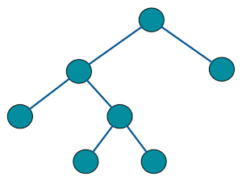
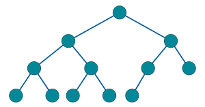

# Single Linked List

**Binary Tree [Source Wikipedia](https://en.wikipedia.org/wiki/Linked_list)**

In computer science, a binary tree is a tree data structure in which each node has at most two children, which are referred to as the left child and the right child.

* A labeled binary tree of size 9 and height 3, with a root node whose value is 2. The above tree is unbalanced and not sorted.

## Types of binary trees

* A **rooted binary tree** has a root node and every node has at most two children.
* A **full binary tree** is a tree in which every node has either 0 or 2 children.

* A **complete binary tree** every level, except possibly the last, is completely filled, and all nodes in the last level are as far left as possible.

* A **perfect binary** tree is a binary tree in which all interior nodes have two children and all leaves have the same depth or same level.
* A **balanced binary tree** is a binary tree structure in which the left and right subtrees of every node differ in height by no more than 1.

# Common operations

* **Insertion** - Nodes can be inserted into binary trees in between two other nodes or added after a leaf node. In binary trees, a node that is inserted is specified as to which child it is.
* **Deletion** - Deletion is the process whereby a node is removed from the tree. Only certain nodes in a binary tree can be removed unambiguously.
* **Traversal** - Pre-order, in-order, and post-order traversal visit each node in a tree by recursively visiting each node in the left and right subtrees of the root.
