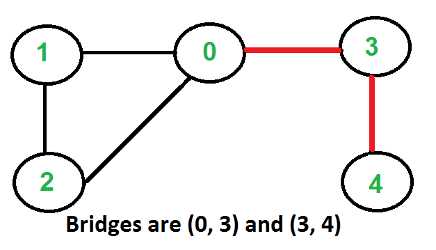

# Bridges in a graph

Problem description: [GeeksforGeeks](https://www.geeksforgeeks.org/bridge-in-a-graph/amp/)

An edge in an undirected connected graph is a bridge if removing it disconnects the graph. For a disconnected undirected graph, definition is similar, a bridge is an edge removing which increases number of disconnected components.
Bridges represent vulnerabilities in a connected network and are useful for designing reliable networks. For example, in a wired computer network, an articulation point indicates the critical computers and a bridge indicates the critical wires or connections.



## Algorithm

A simple approach is to one by one remove all edges and see if removal of an edge causes disconnected graph.

* For every edge (u, v), do following
  * remove (u, v) from graph
  * check if the graph remains connected (We can either use BFS or DFS)
  * add (u, v) back to the graph and iterate for other edge

This is a brute force algorithm with high time complexity, read the alternate solution from geeksforgeeks.

## Result

```bash
$ go run main.go 
Edge 0 --- 3 is a bridge
Edge 3 --- 4 is a bridge
```
