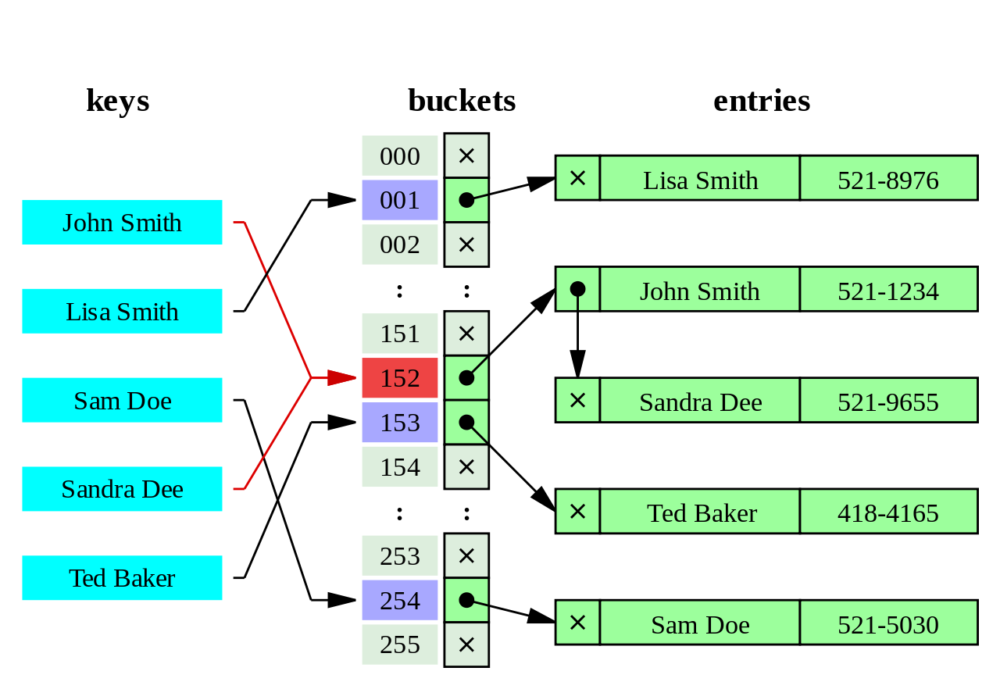

# HashTable (HashMap)

Source: [Wikipedia](https://en.wikipedia.org/wiki/Hash_table)

A Hash Table (Hash Map) is a data structure that implements an associative array abstract data type, a structure that can `map keys to values`. A hash table uses a hash function to compute an index into an array of buckets or slots, from which the desired value can be found. During lookup, the key is hashed and the resulting hash indicates where the corresponding value is stored.

Ideally, the hash function will assign each key to a unique bucket, but most hash table designs employ an imperfect hash function, which might cause hash collisions where the hash function generates the same index for more than one key. Such collisions are typically accommodated in some way.

## Collision resolution with linked list chaining

The most common hash table implementation uses chaining with linked lists to resolve collisions. This combines the best properties of arrays and linked lists.

Hash table operations are performed in two steps:

* a key is converted into an integer index by using a hash function.
* the index decides the bucket (which is a linked list) where the key-value pair record belongs.



As you can see in the above diagram, two keys have the same calculated bucket, `152`, meaning that there is a collision that can be resolved by chaining the records into a linked list.  
Check Out the [Linked List material](https://github.com/danrusei/algorithms_with_Go/tree/main/linkedlist) if you are not familiar with this data structure.

## Result

The underlying array used for my HashTable implementation has a length of 16. I created a utility function String() to print out how the KV elements are distributed across the array. The colision was resolved by chaining the elements from the same bucket into a linked list.

```bash
$ go run bin/main.go 
Bucket 0 has the following Nodes: {first 1}
Bucket 1 has the following Nodes: {tenth 10}  {seventh 7}
Bucket 2 has no Nodes
Bucket 3 has no Nodes
Bucket 4 has the following Nodes: {second 2}
Bucket 5 has the following Nodes: {eleventh 11}
Bucket 6 has the following Nodes: {nineth 9}  {sixth 6}
Bucket 7 has the following Nodes: {eigth 8}  {fifth 5}
Bucket 8 has no Nodes
Bucket 9 has the following Nodes: {thrid 3}
Bucket 10 has the following Nodes: {fourth 4}
Bucket 11 has no Nodes
Bucket 12 has no Nodes
Bucket 13 has no Nodes
Bucket 14 has no Nodes
Bucket 15 has no Nodes
```
